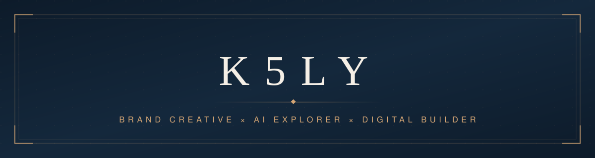

 

 

<i>Turning ideas into structured systems, and using emerging technology to expand creativity.</i>

---

### About

I work at the intersection of **brand storytelling**, **creative technology**, and **AI-assisted workflows**.

My focus is simple: turn ideas into structured systems. Content frameworks, prompt systems, editorial processes. Then use emerging technology to expand what creativity can do.

I'm not a traditional developer. I think in narratives, systems, and the tools that bring them to life.

---

### Featured Projects

| | Project | What it is |
|:---:|---|---|
| ✦ | **[ai-brand-studio](https://github.com/K5LY/ai-brand-studio)** | AI-assisted creative workflows: prompt systems, brand voice experiments, content generation frameworks |
| ✦ | **[creative-content-lab](https://github.com/K5LY/creative-content-lab)** | Content strategy in practice: editorial frameworks, storytelling structures, campaign analysis |
| ✦ | **[digital-experiments](https://github.com/K5LY/digital-experiments)** | Curiosity, logged: small AI tools, automation experiments, creative prototypes |

---

### AI Workflow

Exploring how AI improves **research**, **ideation**, **writing**, and **content systems**. The workflow itself is treated as a creative product.

&nbsp; `ChatGPT` &nbsp;·&nbsp; `CodeX` &nbsp;·&nbsp; `DeepSeek` &nbsp;·&nbsp; `WorkBuddy` &nbsp;·&nbsp; `dots`

> *Exploring, not expert. The workflow is the experiment.*

---

### Currently Exploring

- **AI agents**: multi-step workflows & creative automation
- **Content intelligence**: systems that learn from what performs
- **Creative coding**: generative design & digital prototypes
- **Human-centered technology**: tools that amplify, not replace

---

Open to collaborations across brand, content, and AI-driven creativity.

  

<b>K5LY</b> · stories, systems & experiments

